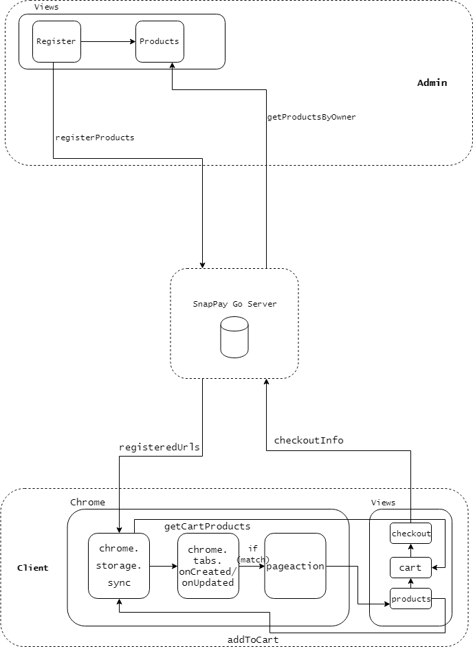

# SnapPay_chrome
A SnayPay chrome extension repo for url detection and OAuth2

## Data Flow

### Basic

- Admin
  - Register products in `register` page, send it to go server
  - Get registered products from go server
- Client
  - get `registeredUrls` from go server, put them into sync storage
  - on tab create or update, check if current url matches one of `registeredUrls`
  - if matches, fire `pageaction`, activating chrome extension, showing `products` page
  - for sync between `cartProducts`, put product info into `storage` when user adds the product to cart, and pull it when it loads cart page.
  - when user checks out, send the data to go server and sync it to admin side

#### Issue

1. How to sync db with admin and client sides
2. Better way to sync cart products/data across multiple tabs?
3. Things to add in admin side?

### Authentication

login page -> google api -> jwt token
